# LightKV

一个基于 Java 构建的高性能分布式键值存储系统，具有强一致性保证和水平扩展能力。

## 系统架构

### 组件架构图

```mermaid
flowchart TB
    %% 定义样式
    classDef clientStyle fill:#e1f5fe,stroke:#01579b,stroke-width:2px
    classDef coordinatorStyle fill:#f3e5f5,stroke:#4a148c,stroke-width:2px
    classDef consensusStyle fill:#fff3e0,stroke:#e65100,stroke-width:2px
    classDef storageStyle fill:#e8f5e9,stroke:#1b5e20,stroke-width:2px
    
    %% 客户端层
    subgraph Client["客户端层"]
        CLI["KVCommandClient.java<br/>命令行界面"]
        KVC["KVClient.java<br/>客户端核心"]
        API["KVService.java<br/>Thrift API"]
    end

    %% 协调器层
    subgraph Coordinator["协调器层"]
        Router["RouterManager.java<br/>路由管理"]
        Meta["MetadataManager.java<br/>元数据管理"]
        subgraph Consensus["一致性保证"]
            Raft["RaftNode.java<br/>Raft协议实现"]
            Log["RocksDBLogStore.java<br/>日志存储"]
        end
    end

    %% 存储层
    subgraph Storage["存储层"]
        subgraph Node["StorageNodes"]
            KVS["RocksDBStorage.java<br/>KV存储引擎"]
            BF["BloomFilterImpl.java<br/>布隆过滤器"]
            SM["KVStateMachine.java<br/>状态机"]
        end
    end

    %% 连接关系
    CLI -->|"命令调用"| KVC
    KVC -->|"ThriftRPC"| API
    API -->|"请求处理"| Router
    Router -->|"路由请求"| Meta
    Meta -->|"节点管理"| Consensus
    Raft -->|"写入"| Log
    Raft -->|"状态复制"| SM
    SM -->|"存储操作"| KVS
    KVS -->|"过滤"| BF

    %% 应用样式
    class Client,CLI,KVC,API clientStyle
    class Coordinator,Router,Meta coordinatorStyle
    class Consensus,Raft,Log consensusStyle
    class Storage,Node,KVS,BF,SM storageStyle
```



### 写入流程图


系统由三层主要组件构成：

### 客户端层
- 命令行交互界面
- Thrift API 接口
- 支持基础的 KV 操作（GET、PUT、DELETE）

### 协调器层
- 集群状态的元数据管理
- 分布式协调
- 写前日志(WAL)保证数据持久性
- 一致性哈希实现数据分布

### 存储层
- 基于 RocksDB 的存储节点
- Bloom Filter 优化查询效率
- 多副本支持高可用
- 节点间异步复制

## 核心特性

- 🚀 高性能：RocksDB 存储引擎 + Bloom Filter 优化
- 💪 强一致性：写前日志 + 同步复制机制
- 📈 可扩展性：一致性哈希实现水平扩展
- 🛡️ 高可用性：自动故障转移 + 数据多副本
- 🔌 易集成：支持 Thrift API

## 快速开始

### 环境要求

- Java 8 或更高版本
- Maven 3.6+
- RocksDB 6.0+

### 构建项目

```bash
mvn clean install
```

### 启动服务器

```bash
cd kv-server
java -jar target/kv-server-1.0-SNAPSHOT.jar
```

### 使用命令行工具

```bash
cd kv-client
java -jar target/kv-client-1.0-SNAPSHOT.jar
```

## 项目结构

```
distributed-kv/
├── pom.xml                              # 父项目POM
├── kv-common/                           # 公共工具模块
├── kv-client/                           # 客户端实现
├── kv-server/                           # 服务端核心
└── kv-thrift/                           # Thrift接口定义
```

## 模块职责

### 客户端模块
- Thrift 通信框架实现
- 命令行工具开发
- 客户端 API 实现
- 单元测试和文档编写

### 元数据管理模块
- 节点管理和路由实现
- 一致性哈希实现
- 集成测试和优化

### 存储模块
- RocksDB 集成
- 本地存储接口实现
- Bloom Filter 开发
- 性能优化和测试

### 一致性模块
- 写前日志（WAL）实现
- 副本管理开发
- 数据同步机制
- 故障恢复测试

## API 使用示例

```java
// 使用 Java API
KVService.Client client = new KVService.Client();
client.put("key", "value");
String value = client.get("key");
```

## 参与贡献

1. Fork 本仓库
2. 创建特性分支 (`git checkout -b feature/新特性`)
3. 提交更改 (`git commit -m '添加某个新特性'`)
4. 推送到分支 (`git push origin feature/新特性`)
5. 创建 Pull Request

## 开发团队

- 客户端模块开发人员
- 元数据管理模块开发人员
- 存储模块开发人员
- 一致性模块开发人员

## 技术栈

本项目主要使用以下技术：

- Java 作为主要开发语言
- RocksDB 作为存储引擎
- Raft算法实现分布式协调
- Thrift 作为 RPC 框架
- Maven 进行项目管理
- JUnit 进行单元测试

## 风险与挑战

1. 数据一致性
    - 采用 WAL + 同步复制机制保证
    - 实现故障恢复机制

2. 系统性能
    - 使用 Bloom Filter 优化查询
    - RocksDB 性能调优
    - 异步复制减少延迟

3. 可用性保证
    - 多副本机制
    - 自动故障转移
    - 定期健康检查

## 监控与运维

- 系统指标监控
    - QPS/TPS
    - 延迟统计
    - 存储容量
    - 节点状态

- 运维支持
    - 节点扩缩容
    - 数据迁移
    - 配置更新
    - 日志管理
